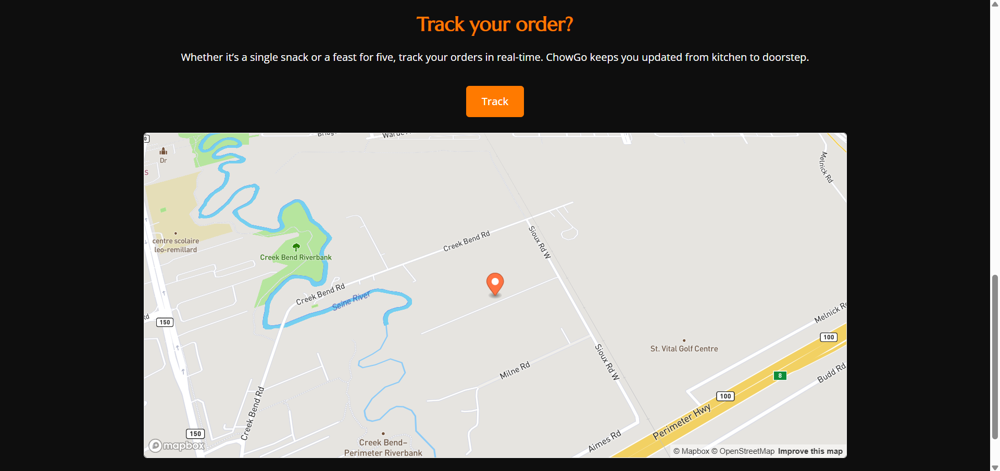

## ChowGo website wit GPS tracker

#### Overview

ChowGo is a sleek and interactive food delivery web app that mimics platforms like Uber Eats and DoorDash. Built with modern HTML, CSS, and JavaScript, the app allows users to explore delicious meals and track their orders in real time using geolocation and Mapbox. It showcases both UI/UX sensibility and practical frontend development skills.

#### Project features 
- **Hero Section** that introduces users to ChowGo’s core service: delivering food fast and fresh
- **Real-time Order Tracking** using the Geolocation API and Mapbox GL JS
- **Clean Design** with a warm color palette and thoughtful layout

#### Technologies used 
- **HTML5** – Semantic structure and clean markup
- **SCSS/CSS3** – Responsive styles, component-based design, and animations
- **JavaScript (ES6)** – Dynamic interactivity, event handling, and geolocation
- **Mapbox GL JS** – Map rendering and real-time GPS tracking